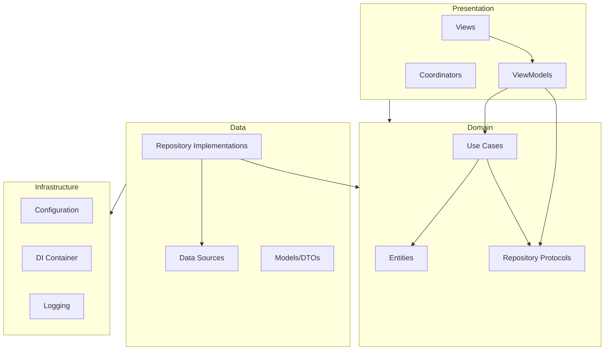

# BaseApp Architecture

This document describes the Clean Architecture used in BaseApp: layer responsibilities, dependency rules, and how to add new features and use cases.

---

## 1. Layer Overview

The app is split into four main layers. Dependencies point inward: outer layers depend on inner layers; inner layers do not know about outer ones.

```
┌─────────────────────────────────────────────────────────────────┐
│  Presentation (Views, ViewModels, Coordinators)                 │
│  → depends on Domain only (use cases, repository protocols)      │
└───────────────────────────┬─────────────────────────────────────┘
                            │
┌───────────────────────────▼─────────────────────────────────────┐
│  Domain (Entities, Use Cases, Repository Protocols)             │
│  → no UIKit/SwiftUI, no concrete implementations                │
└───────────────────────────┬─────────────────────────────────────┘
                            │
┌───────────────────────────▼─────────────────────────────────────┐
│  Data (Repository Implementations, Data Sources, Models/DTOs)    │
│  → depends on Domain + Infrastructure (config, logging)         │
└───────────────────────────┬─────────────────────────────────────┘
                            │
┌───────────────────────────▼─────────────────────────────────────┐
│  Infrastructure (Configuration, DI, Logging)                     │
│  → wires Data layer and injects into Presentation               │
└─────────────────────────────────────────────────────────────────┘
```

### Diagram (dependency flow)



---

## 2. Layer Details

### Domain

- **Location:** `Core/Domain/`, `Features/<Feature>/Domain/`
- **Contains:** Entities, repository/service protocols, use case protocols (and sometimes use case implementations if they are pure logic).
- **Rules:**
  - No imports of UIKit, SwiftUI, or concrete Data/Infrastructure types.
  - Only Swift standard library and Foundation (and shared Domain types).
- **Examples:** `AppState`, `ConversionData`, `ServerResponse` (entities); `ConversionDataRepositoryProtocol`, `NetworkRepositoryProtocol`, `AppInitializerUseCaseProtocol` (protocols).

### Data

- **Location:** `Core/Data/`, `Features/<Feature>/Data/`
- **Contains:** Repository implementations, data sources (local/remote), DTOs or request/response models.
- **Rules:**
  - Implements Domain protocols (repositories, data sources).
  - May depend on Infrastructure: `AppConfigurationProtocol`, `Logging` (via protocol).
  - No dependency on Presentation (no ViewModels, no Views).
- **Examples:** `ConversionDataRepository`, `ServerAPIRepository`, `AppsFlyerRepository`, `FCMTokenProvider`, `ConversionDataLocalDataSource`.

### Presentation

- **Location:** `Core/Presentation/`, `Features/<Feature>/Presentation/`
- **Contains:** ViewModels, SwiftUI Views, coordinators (if used).
- **Rules:**
  - Depends only on Domain: use case protocols, repository protocols, entities.
  - Does not import concrete Data or Infrastructure types (only protocols exposed via DI).
  - Receives dependencies via initializer or environment (from DI container).
- **Examples:** `AppViewModel`, `RootView`, `LoadingView`, `FirstLaunchScreen`, `WebViewScreen`.

### Infrastructure

- **Location:** `Infrastructure/`
- **Contains:** Configuration (`AppConfiguration`, `AppConfigurationProtocol`), DI (`DependencyContainer`, `DefaultDependencyContainer`), logging (`Logging`, `LogStorageProtocol`, `DefaultLogger`, `LogStore`).
- **Responsibility:** Build the dependency graph (Data + Infrastructure), expose a single container, and inject it into the app root and AppDelegate. No business logic; only wiring and cross-cutting concerns.

---

## 3. Import Rules (Summary)

| Layer          | May import                          | Must not import                          |
|----------------|-------------------------------------|------------------------------------------|
| Domain         | Foundation, Swift, other Domain     | UIKit, SwiftUI, Data, Infrastructure     |
| Data           | Domain, Infrastructure (protocols) | Presentation                             |
| Presentation   | Domain, SwiftUI                     | Concrete Data/Infrastructure types        |
| Infrastructure | All (to wire them)                 | —                                        |

Views and ViewModels should rely on **protocols** (e.g. `AppInitializerUseCaseProtocol`, `NetworkRepositoryProtocol`) provided by the container, not on `DefaultDependencyContainer` or concrete repositories.

---

## 4. Dependency Injection

- **Single composition root:** Dependencies are assembled in `AppDependencies.makeDefaultContainer()` (using `BuildConfiguration.current` and `AppConfiguration`). The resulting `DependencyContainer` is accessed via `AppDependencies.shared` (or a test override via `setContainerForTesting(_:)`).
- **Usage:** `BaseApp` creates `AppViewModel` with `container.initializeAppUseCase` and `container.pushTokenProvider`. `AppDelegate` uses `AppDependencies.shared` for configuration, analytics, logger, and FCM token storage. All of these are protocol types from Domain/Infrastructure.
- **Testing:** Implement a mock `DependencyContainer` (or mock individual protocols) and call `AppDependencies.setContainerForTesting(mockContainer)` before running the code under test. Do not rely on singletons inside business logic; rely on injected protocols so that tests can substitute them.

---

## 5. Adding a New Feature

Example: adding a feature "Settings".

1. **Domain** (`Features/Settings/Domain/`)
   - Define entities if needed (e.g. `UserSettings`).
   - Define protocols: e.g. `SettingsRepositoryProtocol`, `SaveSettingsUseCaseProtocol`.
   - Optionally put a use case implementation here if it is pure logic; otherwise implement in Data.

2. **Data** (`Features/Settings/Data/`)
   - Implement `SettingsRepository` conforming to `SettingsRepositoryProtocol`.
   - Add data sources or API clients as needed; keep them behind Domain protocols.

3. **Presentation** (`Features/Settings/Presentation/`) (if the feature has UI)
   - Create `SettingsViewModel` that takes `SaveSettingsUseCaseProtocol` (and other protocols) in `init`.
   - Create Views that use the ViewModel (and receive container or dependencies via environment/init).

4. **Infrastructure / DI**
   - In `DependencyContainer` (protocol and `DefaultDependencyContainer`), add:
     - `var settingsRepository: SettingsRepositoryProtocol { get }`
     - `var saveSettingsUseCase: SaveSettingsUseCaseProtocol { get }` (if you expose a use case).
   - In `AppDependencies.makeDefaultContainer()`, instantiate the new repository and use case, and pass them into `DefaultDependencyContainer`.

5. **Usage**
   - In the root or parent view, get `container.settingsRepository` or `container.saveSettingsUseCase` and pass them into `SettingsViewModel` (or expose via environment). Views and ViewModels do not reference concrete Data types.

---

## 6. Adding a New Use Case

Example: adding "Fetch user profile" use case.

1. **Domain**
   - In the appropriate feature (e.g. `Features/Profile/Domain/` or `Core/Domain/UseCases/`), define:
     - Protocol: `FetchUserProfileUseCaseProtocol` with a method e.g. `func execute() async throws -> UserProfile`.
   - Ensure `UserProfile` is an entity in Domain (or in the same feature’s Domain).

2. **Data**
   - Implement the use case in a class that conforms to `FetchUserProfileUseCaseProtocol`, e.g. `FetchUserProfileUseCase`. It should depend only on repository protocols (e.g. `ProfileRepositoryProtocol`) and optionally other use case protocols. Implement the method by calling the repository and mapping DTOs to domain entities.

3. **DI**
   - Add `var fetchUserProfileUseCase: FetchUserProfileUseCaseProtocol { get }` to `DependencyContainer` and `DefaultDependencyContainer`.
   - In `makeDefaultContainer()`, create the repository (if new), then create `FetchUserProfileUseCase` and register it in the container.

4. **Presentation**
   - In the ViewModel that needs profile data, inject `FetchUserProfileUseCaseProtocol` and call `execute()`; map the result to UI state. Do not inject the repository directly if the use case is the intended API for this screen.

---

## 7. Folder Structure Reference

```
App/                    # Entry point: @main, AppDelegate, BuildConfiguration, AppDependencies
Core/
  Domain/               # Entities, repository protocols, use cases (shared)
  Data/                 # Repositories, data sources, models (shared)
  Presentation/        # Shared ViewModels, Views, coordinators
Features/
  <Feature>/            # e.g. Analytics, AppInitialization, Networking, Notifications, WebView
    Domain/             # Feature-specific protocols and entities
    Data/               # Feature-specific implementations
    Presentation/       # Feature-specific UI (if any)
Infrastructure/         # Configuration, DI, Logging, cross-cutting
Resources/              # Assets, xcconfig, Preview Content
Docs/                   # Architecture and design docs
```

This layout keeps Domain independent, Data and Presentation testable via protocols, and Infrastructure as the only place that knows about concrete implementations.
