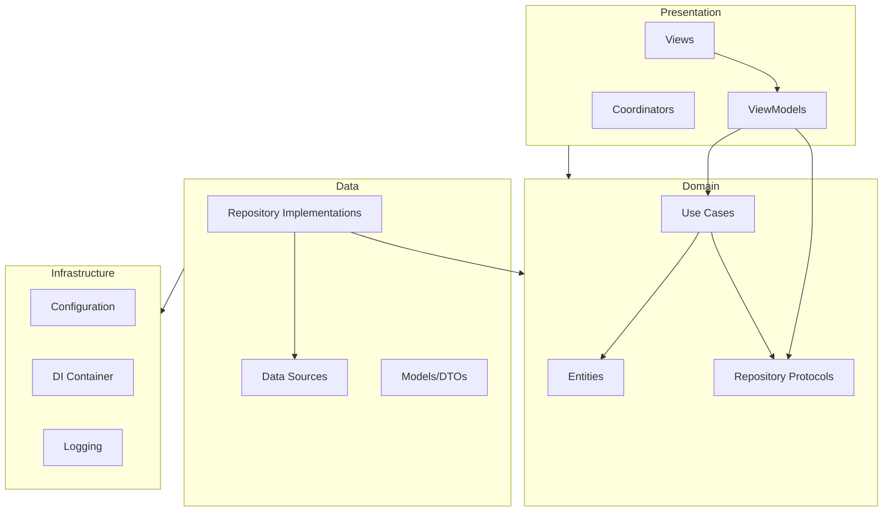

# Архитектура BaseProject

В документе описана Clean Architecture в BaseProject: зоны ответственности слоёв, правила зависимостей и добавление новых фич и use cases.

---

## 1. Обзор слоёв

Приложение разделено на четыре основных слоя. Зависимости направлены внутрь: внешние слои зависят от внутренних; внутренние не знают о внешних.

```
┌─────────────────────────────────────────────────────────────────┐
│  Presentation (Views, ViewModels, Coordinators)                  │
│  → зависит только от Domain (use cases, протоколы репозиториев)  │
└───────────────────────────┬─────────────────────────────────────┘
                             │
┌───────────────────────────▼─────────────────────────────────────┐
│  Domain (Entities, Use Cases, протоколы репозиториев)            │
│  → без UIKit/SwiftUI, без конкретных реализаций                  │
└───────────────────────────┬─────────────────────────────────────┘
                             │
┌───────────────────────────▼─────────────────────────────────────┐
│  Data (реализации репозиториев, Data Sources, модели/DTO)        │
│  → зависит от Domain + Infrastructure (конфиг, логирование)      │
└───────────────────────────┬─────────────────────────────────────┘
                             │
┌───────────────────────────▼─────────────────────────────────────┐
│  Infrastructure (Configuration, DI, Logging)                    │
│  → собирает Data и внедряет в Presentation                       │
└─────────────────────────────────────────────────────────────────┘
```

### Схема направлений зависимостей



---

## 2. Детали слоёв

### Domain

- **Расположение:** `Core/Domain/`, `Features/<Feature>/Domain/`
- **Содержит:** сущности (entities), протоколы репозиториев и сервисов, протоколы use cases (и при необходимости сами реализации use cases, если это чистая логика).
- **Правила:**
  - Не импортировать UIKit, SwiftUI и конкретные типы из Data/Infrastructure.
  - Только стандартная библиотека Swift и Foundation (и общие типы Domain).
- **Примеры:** `AppState`, `ConversionData`, `ServerResponse` (сущности); `ConversionDataRepositoryProtocol`, `NetworkRepositoryProtocol`, `AppInitializerUseCaseProtocol` (протоколы).

### Data

- **Расположение:** `Core/Data/`, `Features/<Feature>/Data/`
- **Содержит:** реализации репозиториев, data sources (локальные/удалённые), DTO или модели запросов/ответов.
- **Правила:**
  - Реализует протоколы Domain (репозитории, data sources).
  - Может зависеть от Infrastructure: `AppConfigurationProtocol`, логгер (через протокол).
  - Нет зависимости от Presentation (ни ViewModels, ни Views).
- **Примеры:** `ConversionDataRepository`, `ServerAPIRepository`, `AppsFlyerRepository`, `FCMTokenProvider`, `ConversionDataLocalDataSource`.

### Presentation

- **Расположение:** `Core/Presentation/`, `Features/<Feature>/Presentation/`
- **Содержит:** ViewModels, SwiftUI Views, координаторы (если используются).
- **Правила:**
  - Зависит только от Domain: протоколы use cases, репозиториев, сущности.
  - Не импортирует конкретные типы Data или Infrastructure (только протоколы, проброшенные через DI).
  - Получает зависимости через инициализатор или environment (из DI-контейнера).
- **Примеры:** `AppViewModel`, `RootView`, `LoadingView`, `FirstLaunchScreen`, `WebViewScreen`.

### Infrastructure

- **Расположение:** `Infrastructure/`
- **Содержит:** конфигурация (`AppConfiguration`, `AppConfigurationProtocol`), DI (`DependencyContainer`, `DefaultDependencyContainer`), логирование (`Logging`, `LogStorageProtocol`, `DefaultLogger`, `LogStore`).
- **Назначение:** построение графа зависимостей (Data + Infrastructure), экспорт одного контейнера и внедрение его в корень приложения и AppDelegate. Без бизнес-логики; только сборка и сквозные задачи.

---

## 3. Правила импортов (сводка)

| Слой          | Может импортировать              | Не должен импортировать              |
|---------------|-----------------------------------|--------------------------------------|
| Domain        | Foundation, Swift, другой Domain   | UIKit, SwiftUI, Data, Infrastructure  |
| Data          | Domain, Infrastructure (протоколы)| Presentation                         |
| Presentation  | Domain, SwiftUI                   | Конкретные типы Data/Infrastructure  |
| Infrastructure| Все (для сборки)                 | —                                    |

Views и ViewModels должны опираться на **протоколы** (например, `AppInitializerUseCaseProtocol`, `NetworkRepositoryProtocol`), предоставляемые контейнером, а не на `DefaultDependencyContainer` или конкретные репозитории.

---

## 4. Внедрение зависимостей (DI)

- **Единая точка сборки:** зависимости собираются в `AppDependencies.makeDefaultContainer()` (с учётом `BuildConfiguration.current` и `AppConfiguration`). Результат доступен через `AppDependencies.shared` (или тестовый вариант через `setContainerForTesting(_:)`).
- **Использование:** точка входа приложения создаёт `AppViewModel` с `container.initializeAppUseCase` и `container.pushTokenProvider`. AppDelegate использует `AppDependencies.shared` для конфигурации, аналитики, логгера и хранения FCM-токена. Всё это — типы протоколов из Domain/Infrastructure.
- **Тестирование:** реализовать мок `DependencyContainer` (или отдельные протоколы) и вызвать `AppDependencies.setContainerForTesting(mockContainer)` до запуска тестируемого кода. Не опираться на синглтоны в бизнес-логике; использовать внедряемые протоколы, чтобы в тестах подставлять моки.

---

## 5. Добавление новой фичи

Пример: добавление фичи «Настройки».

1. **Domain** (`Features/Settings/Domain/`)
   - При необходимости описать сущности (например, `UserSettings`).
   - Описать протоколы: например `SettingsRepositoryProtocol`, `SaveSettingsUseCaseProtocol`.
   - При необходимости разместить реализацию use case здесь, если она чисто логическая; иначе — в Data.

2. **Data** (`Features/Settings/Data/`)
   - Реализовать `SettingsRepository`, соответствующий `SettingsRepositoryProtocol`.
   - Добавить data sources или API-клиенты по необходимости; держать их за протоколами Domain.

3. **Presentation** (`Features/Settings/Presentation/`) (если у фичи есть UI)
   - Создать `SettingsViewModel`, принимающий в `init` `SaveSettingsUseCaseProtocol` (и другие протоколы).
   - Создать Views, использующие ViewModel (контейнер или зависимости — через environment/init).

4. **Infrastructure / DI**
   - В протоколе и реализации `DependencyContainer` добавить:
     - `var settingsRepository: SettingsRepositoryProtocol { get }`
     - при необходимости `var saveSettingsUseCase: SaveSettingsUseCaseProtocol { get }`
   - В `AppDependencies.makeDefaultContainer()` создать новый репозиторий и use case и передать их в `DefaultDependencyContainer`.

5. **Использование**
   - В корневом или родительском экране получить `container.settingsRepository` или `container.saveSettingsUseCase` и передать их во ViewModel (или через environment). Views и ViewModels не ссылаются на конкретные типы Data.

---

## 6. Добавление нового Use Case

Пример: use case «Получить профиль пользователя».

1. **Domain**
   - В подходящей фиче (например, `Features/Profile/Domain/` или `Core/Domain/UseCases/`) описать:
     - протокол, например `FetchUserProfileUseCaseProtocol` с методом `func execute() async throws -> UserProfile`;
   - убедиться, что `UserProfile` — сущность в Domain (или в Domain этой фичи).

2. **Data**
   - Реализовать use case в классе, соответствующем `FetchUserProfileUseCaseProtocol` (например, `FetchUserProfileUseCase`). Он должен зависеть только от протоколов репозиториев и при необходимости других use case. В методе вызывать репозиторий и маппить DTO в доменные сущности.

3. **DI**
   - В `DependencyContainer` и `DefaultDependencyContainer` добавить `var fetchUserProfileUseCase: FetchUserProfileUseCaseProtocol { get }`.
   - В `makeDefaultContainer()` создать репозиторий (если новый), затем `FetchUserProfileUseCase` и зарегистрировать в контейнере.

4. **Presentation**
   - Во ViewModel, которому нужны данные профиля, внедрить `FetchUserProfileUseCaseProtocol` и вызывать `execute()`; результат преобразовывать в состояние UI. Не внедрять репозиторий напрямую, если публичным API для экрана должен быть именно use case.

---

## 7. Структура папок (справочно)

```
App/                    # Точка входа: @main, AppDelegate, BuildConfiguration, AppDependencies
Core/
  Domain/               # Сущности, протоколы репозиториев, use cases (общие)
  Data/                 # Репозитории, data sources, модели (общие)
  Presentation/        # Общие ViewModels, Views, координаторы
Features/
  <Feature>/            # Например: Analytics, AppInitialization, Networking, Notifications, WebView
    Domain/             # Протоколы и сущности фичи
    Data/               # Реализации фичи
    Presentation/       # UI фичи (если есть)
Infrastructure/         # Configuration, DI, Logging, сквозные вещи
Resources/              # Assets, xcconfig, Preview Content
Docs/                   # Документация по архитектуре и дизайну
```

Такая структура сохраняет независимость Domain, тестируемость Data и Presentation через протоколы; о конкретных реализациях знает только Infrastructure.

Подробное пошаговое руководство по расширению проекта — в [Docs/EXTENDING.md](EXTENDING.md).
